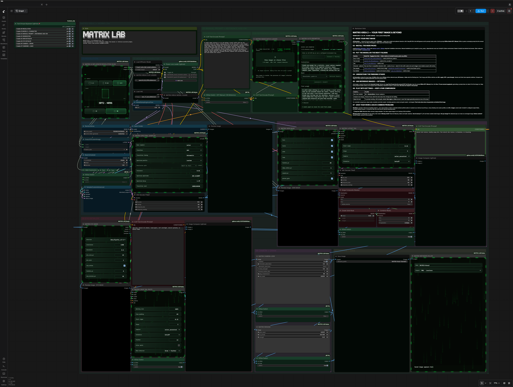
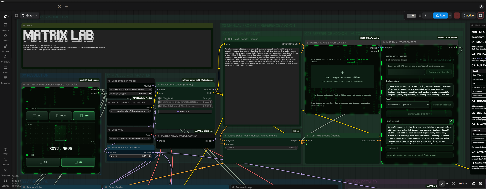
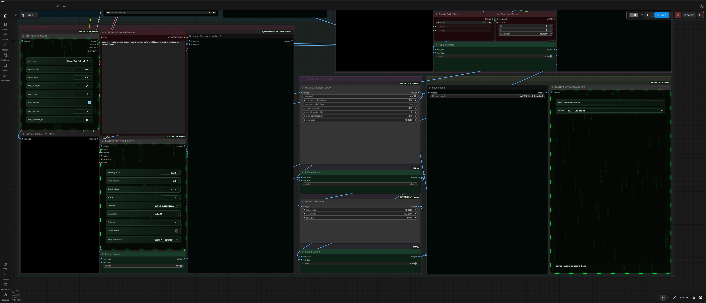

# MATRIX Krea 2 Workflow — V1

Create 2K and 4K AI influencer images in ComfyUI with manual prompting, optional reference-assisted prompts, skin and eye detail, and separate finishing controls.

**Workflow release: 1.0.0 · MATRIX-LAB-Nodes: 0.3.3 · FP8 · Classic canvas**

This package contains one complete workflow, its API companion, the pinned MATRIX node archive, and installation guides. Models and rgthree-comfy are installed separately. This is a private MATRIX LAB release for authorized recipients.

**[Download the complete V1 ZIP](https://github.com/JsonMatrixLab/MATRIX-Krea2-Workflow/releases/download/v1.0.0/MATRIX-Krea2-V1.zip)** · [Install](INSTALL.md) · [Models and dependencies](MODELS.md) · [AI-agent installation](AGENT-INSTALL.md)

The screenshots show the actual local Classic canvas with both custom-node packs installed. Model weights were not loaded and no image generation was performed for these illustrations; previews are intentionally empty.

## Start here

1. Download and extract **MATRIX-Krea2-V1.zip** from the release above.
2. Follow [INSTALL.md](INSTALL.md) to install the two node packs and model files.
3. Drag **MATRIX-Krea2-V1.json** into ComfyUI Classic.
4. Choose **2K or 4K** and an aspect ratio in **00 Resolution**.
5. Keep the prompt switch **OFF / Manual**, enter your prompt, then run the workflow when ready.

No provider account is needed for manual prompting. The optional Auto Prompter uses xAI only when you configure it and explicitly click **Generate Prompt**. In V1, review its result and copy it into the manual prompt before generating an image.

## Read the canvas

| Stage | What you control |
| --- | --- |
| **00 Resolution** | 2K / 4K output and aspect ratio. |
| **01 Models + Character** | Diffusion model, protected encoder, VAE and optional LoRAs. The supplied optional LoRA rows start OFF. |
| **02 Manual Prompt + Reference Add-on** | Write a prompt directly, or use reference images to help draft one. Keep both prompt encoders active. |
| **03 Generation** | Base image generation and noise seed. |
| **04 Skin Detailer** | Skin masking and refinement. |
| **05 Eye Detailer** | Detected-eye refinement; an empty detection can leave the image unchanged. |
| **06 Camera + Grain** | Separate Camera Look and Renoise controls. |
| **07 Compare + Save** | Compare stages and save the finished image through standard Save Image and Metadata Killer. |

Image-path switches use **ON = apply / OFF = pass through**. The prompt switch is different: keep it **OFF / Manual** for the documented V1 copy-and-paste flow. Do not bypass the individual prompt encoders.

## What is included

| File | Purpose |
| --- | --- |
| `MATRIX-Krea2-V1.json` | The workflow to import into the canvas. |
| `API/MATRIX-Krea2-V1.api.json` | Companion graph for automated execution. |
| `Custom-Nodes/MATRIX-LAB-Nodes-0.3.3.zip` | Pinned MATRIX node source archive. |
| `INSTALL.md`, `MODELS.md` | Setup, model downloads and troubleshooting. |
| `AGENT-INSTALL.md` | Installation instructions for an AI coding agent. |
| `assets/` | Actual canvas screenshots used in this guide. |
| `VERSION.txt` | Release identity and pinned node revisions. |

The upstream node archive includes its own examples. **Use the workflow at this package's root**, which is the portable V1 supplied here.

## Custom nodes

- **[MATRIX-LAB-Nodes](https://github.com/JsonMatrixLab/MATRIX-LAB-Nodes)** — workflow-specific MATRIX controls, protected loading, detail and finishing nodes. Pinned source: [`8d07b22`](https://github.com/JsonMatrixLab/MATRIX-LAB-Nodes/tree/8d07b22e61df53e82837f529736436a9cdc3991c).
- **[rgthree-comfy](https://github.com/rgthree/rgthree-comfy)** — LoRA loader, group controls and image comparison. See [INSTALL.md](INSTALL.md) for the pinned revision.

GitHub access to this private workflow repository does not automatically grant access to the separate node repository. The included node archive supports installation without cloning that repository.

## Saving and sharing

Keep the workflow JSON separately. **Metadata Killer removes image metadata**, so its output is not a workflow backup. Standard Save Image can preserve workflow metadata; choose the clean output when sharing images. On remote ComfyUI, download the saved image from the server.

This release packages the existing V1 generation path. Historical 4K execution used an RTX 5090; other GPUs, runtime versions and arbitrary LoRAs are not covered by that scope. No new generation or final workflow test was performed for this packaging release.

## Access and license

Repository and release downloads require authorized GitHub access. Share the ZIP directly only with authorized recipients. Workflow materials are proprietary; see [LICENSE](LICENSE). Bundled node source retains its own license, and external models and rgthree retain their respective terms. See [SECURITY.md](SECURITY.md) before sharing diagnostics.
